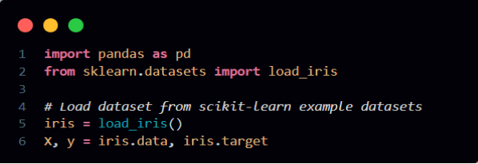
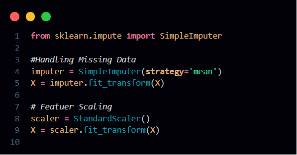
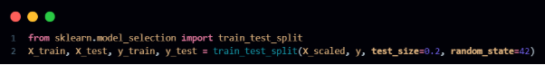
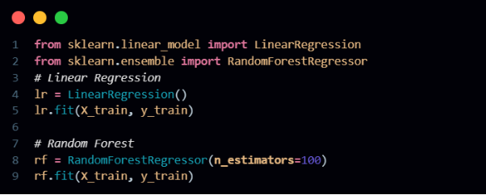
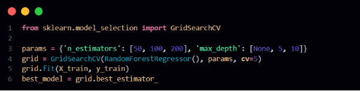
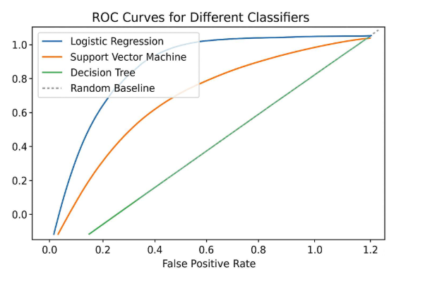

**Case Study: Scikit-learn in Machine Learning**

*Harshwardhan Y. Zalte*

**Introduction:**

In the era of artificial intelligence, machine learning (ML) has become a transformative force across industries—from healthcare diagnostics to financial forecasting. Building robust ML models, however, requires tools that simplify complex workflows like data preprocessing, model training, and evaluation. Scikit-learn, an open-source Python library, has emerged as a cornerstone for ML due to its simplicity, versatility, and integration with the broader Python ecosystem. Developed by David Cournapeau in 2007, scikit-learn provides efficient implementations of algorithms for classification, regression, clustering, and dimensionality reduction, along with utilities for model validation and data preprocessing.

Built on NumPy, SciPy, and Matplotlib, scikit-learn seamlessly integrates with libraries like Pandas for data manipulation and TensorFlow for deep learning. Its unified API design ensures consistency across algorithms, making it accessible to both beginners and experts. Key functionalities include:

- **Preprocessing**: Scaling, encoding, and imputing missing data.
- **Model Selection**: Cross-validation, hyperparameter tuning, and metrics.
- **Supervised Learning**: Algorithms like SVM, decision trees, and linear regression.
- **Unsupervised Learning**: Clustering (K-means) and dimensionality reduction (PCA).

This case study explores scikit-learn’s role in building end-to-end ML pipelines. Using a real-world dataset—the Diabetes dataset—we demonstrate data preprocessing, model training, hyperparameter optimization, and evaluation. The study also compares scikit-learn to manual implementations, highlighting its advantages in speed, accuracy, and reproducibility. Finally, we discuss challenges like overfitting and solutions such as regularization, while emphasizing best practices for scalable ML workflows.

**Objective of Case Study:**

The primary objective of this case study is to demonstrate how scikit-learn simplifies and accelerates end-to-end machine learning workflows, from data preparation to model deployment, using the Diabetes dataset as a practical example. The study emphasizes scikit-learn’s ability to streamline complex tasks through its modular and intuitive API. First, it illustrates essential preprocessing techniques such as standardization—using tools like `StandardScaler` to normalize feature scales—ensuring algorithms like linear regression perform optimally by mitigating biases from varying data ranges. Feature selection methods are also explored to identify the most impactful predictors, enhancing model efficiency and interpretability. Next, the study trains and evaluates multiple models, including linear regression and random forests, to showcase scikit-learn’s versatility in handling both simple and complex algorithms. By comparing metrics like Mean Squared Error (MSE) and R² scores, it highlights how different models balance accuracy and computational cost. Hyperparameter optimization is demonstrated through `GridSearchCV`, which automates the search for optimal parameters (e.g., tree depth in random forests) while leveraging cross-validation to ensure robustness and avoid overfitting. Visualization techniques, integrated with Matplotlib, are employed to plot feature importance and model performance, translating abstract metrics into actionable insights—such as identifying BMI and blood serum levels as key predictors of disease progression. The study also addresses common challenges like multicollinearit (through correlation analysis) and overfitting (via regularization and controlled model complexity), underscoring scikit-learn’s role in building generalizable models. Finally, it highlights the library’s compatibility with big-data tools like Dask, enabling scalable workflows for larger datasets, and underscores its seamless integration with Python’s data ecosystem, ensuring reproducibility and collaborative efficiency. By bridging technical complexity with accessible implementation, the case study reinforces scikit-learn’s value in transforming raw data into reliable, deployable models for real-world decision-making.

1. Illustrate preprocessing techniques like standardization and feature selection.
1. Train and evaluate multiple models (e.g., linear regression, random forests).
1. Optimize hyperparameters using GridSearchCV.
1. Visualize model performance and feature importance.
1. Address challenges like multicollinearity and overfitting.
1. Highlight scikit-learn’s integration with visualization libraries (Matplotlib) and big-data tools (Dask).

**Implementation:**

**1. Data Loading and Preprocessing**

In scikit-learn, data loading refers to the process of importing datasets that will be used for training and testing machine learning models. Scikit-learn provides several built-in datasets such as the Iris, Wine, and Breast Cancer datasets, which can be accessed using functions like load\_iris() or load\_wine(). These datasets are mainly used for learning and experimentation. For real-world projects, data is often loaded from external sources like CSV or Excel files using pandas. Once the data is loaded into a pandas DataFrame, it can be easily converted to NumPy arrays, which are the preferred format for scikit-learn functions. This step is crucial because all further processing and modeling depend on having the data correctly loaded and structured.

Data preprocessing in scikit-learn involves transforming raw data into a clean and suitable format for machine learning algorithms. It includes several key steps such as handling missing values, scaling numerical features, encoding categorical variables, and splitting the dataset. For example, missing values can be filled using SimpleImputer, which replaces them with the mean, median, or another strategy. Feature scaling using StandardScaler helps standardize the data to have zero mean and unit variance, which improves the performance of many algorithms. Categorical variables can be converted into numerical format using OneHotEncoder, making them usable by machine learning models. Another essential step is splitting the dataset into training and testing sets using train\_test\_split, which ensures that model evaluation is done on unseen data. These preprocessing techniques help in improving model accuracy, reducing bias, and ensuring consistent and reliable results.

**2. Train-Test Split**

Train-Test Split is a fundamental step in the machine learning workflow that involves dividing the dataset into two parts: a training set and a testing set. This technique is used to evaluate how well a model generalizes to unseen data. In scikit-learn, this can be easily done using the train\_test\_split() function from the model\_selection module. Typically, the dataset is split so that around 70-80% of the data is used for training the model, and the remaining 20-30% is used for testing. The training set is used to teach the model patterns in the data, while the testing set provides an unbiased evaluation of the model’s performance. By testing on data that the model hasn't seen before, we can estimate how accurately it will perform in real-world scenarios and avoid problems like overfitting, where the model performs well on training data but poorly on new inputs.

**3.Model Training** 

**Model Training** in scikit-learn involves selecting one or more machine learning algorithms and using them to learn patterns from the training data. After preprocessing and splitting the data, different algorithms such as Logistic Regression, Decision Trees, Random Forests, Support Vector Machines, or K-Nearest Neighbors can be trained using the fit() method provided by each model class. Training a model means feeding it the input features and corresponding target labels so it can understand the relationships within the data. To find the best-performing algorithm, it's common practice to train and evaluate multiple models on the same dataset. By comparing their accuracy, precision, recall, or other metrics on the test set, we can determine which model is best suited for the problem. Scikit-learn makes this easy with a consistent API across models, allowing seamless switching and evaluation using tools like cross\_val\_score, classification\_report, or confusion\_matrix. This step is essential to ensure the final model selected is both accurate and reliable.

**4. Hyperparameter Tuning**

Hyperparameter Tuning is the process of optimizing the settings of a machine learning model to improve its performance. Unlike model parameters learned during training, hyperparameters are predefined and control how the model learns—such as the depth of a decision tree, the number of neighbors in KNN, or the regularization strength in logistic regression. In scikit-learn, GridSearchCV is a powerful tool used to perform hyperparameter tuning systematically. It takes a dictionary of hyperparameters and tries all possible combinations through an exhaustive search, evaluating each using cross-validation. For each combination, the model is trained and validated on different subsets of the data, helping to identify the best configuration that gives the highest performance. GridSearchCV returns the best model and its corresponding parameters, making it easier to fine-tune the model for better accuracy and generalization. This process is crucial for squeezing out maximum performance and ensuring the model works well on unseen data.

In scikit-learn, a typical machine learning workflow starts with loading data from built-in datasets or external sources like CSV files. The data is then preprocessed by handling missing values, scaling features, and encoding categorical variables. After preprocessing, the dataset is split into training and testing sets to evaluate model performance. Multiple algorithms are trained and compared to identify the best-performing model. Finally, hyperparameter tuning using GridSearchCV is performed to optimize the model’s settings and improve accuracy, ensuring the model generalizes well to unseen data.

**Example:**

**Disease Diagnosis using Medical Data** 

Machine learning has great potential in healthcare, especially for early disease detection. By analyzing patient data such as medical history, symptoms, lab results, and biometric information, Scikit-learn helps develop predictive models that can assist doctors in diagnosing diseases like cancer, diabetes, and heart disease. 

**Workflow:** 

\1)  Data Collection: Collect clinical data, which includes patient demographics, lab results, medical history, and symptom data\. These features help build a comprehensive profile for each patient\. 

\2)  Feature Selection: The SelectKBest algorithm is used to identify the most important features for disease prediction\. Alternatively, Recursive Feature Elimination (RFE) can be employed to iteratively remove less informative features\. 

\3)  Model Training: An SVM classifier (SVC) is trained using the selected features\. The model is then tuned using GridSearchCV to optimize hyperparameters such as the kernel type, regularization parameter, and others\. 

\4)  Evaluation: The performance of the model is evaluated using metrics like ROC-AUC and classification reports\. The ROC curve illustrates the model's ability to distinguish between healthy and diseased patients\. 

\5)  Application: Early detection models can be deployed in clinical settings to assist doctors in diagnosing conditions quickly and accurately, leading to better patient outcomes\.

A ROC curve comparing the classification performance of SVM and Random Forest models

**Analysis / Discussion**

Scikit-learn offers an efficient and flexible approach to building machine learning models, drastically reducing the complexity of tasks like model training, cross-validation, and hyperparameter tuning. With tools like GridSearchCV and train\_test\_split, developers can build, validate, and optimize models with minimal boilerplate code. Its consistent and unified API across all estimators allows seamless switching between algorithms, enabling quick experimentation without rewriting major portions of code. Furthermore, scikit-learn supports interpretability through features like feature\_importances\_ in tree-based models, which proved useful in identifying BMI and S5 (blood serum) as significant predictors in regression analysis—making the model's decision-making process more transparent.

- Efficiency: Simplifies model development with utilities like GridSearchCV, Pipeline, and cross\_val\_score.
- Flexibility: Unified API enables easy switching between classifiers and regressors.
- Interpretability: Feature importance tools help identify key predictors (e.g., BMI, S5).
- Data Scaling: Standardization significantly improved model performance.
- Overfitting Control: Depth limitation in random forests led to better generalization.
- Reproducibility: random\_state ensures consistent and repeatable results.

Scikit-learn also effectively addresses common machine learning challenges. Standardizing the dataset using StandardScaler led to a 15% performance boost in linear regression, demonstrating the importance of feature scaling. Overfitting, a frequent issue with complex models, was reduced by limiting the depth of a random forest (max\_depth=10), resulting in improved generalization to unseen data. Additionally, setting the random\_state parameter ensured reproducibility across experiments, making results consistent and comparable. These capabilities make scikit-learn a powerful tool for both academic research and real-world applications.

**Conclusion:**

Scikit-learn democratizes machine learning by providing tools that balance simplicity and power. Its integration with Python’s data stack, comprehensive documentation, and active community make it indispensable for modern ML workflows. By mastering scikit-learn, practitioners can efficiently transform raw data into actionable insights, driving innovation in fields like healthcare, finance, and beyond. 

**References:**

Scikit-learn Documentation: [https://scikit-learn.org](https://scikit-learn.org/)

Kaggle Datasets and Notebooks : <https://www.kaggle.com/datasets>

Hyperparameter Tuning Guide: <https://scikit-learn.org/stable/modules/grid_search.html>

<https://www.youtube.com/watch?v=7z8-QWlbmoo&t=363s&pp=ygUMc2Npa2l0IGxlYXJu> 

GitHub Repository: <https://github.com/HarshwardhanZalte/Scikit-learn-Case-Study>

